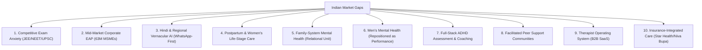

# 🇮🇳 India Mental Wellness: The Founder's Strategy Bible (2026–2035)

> **Document Type**: Market Intelligence, Competitor Autopsy & Go-To-Market Blueprint  
> **Source Material**: `report.pdf` (India Mental Wellness Strategy Report)  
> **Target Application**: **Manraah AI Mental Wellness Platform**

---

## 📌 Executive Summary & The Numbers Defining the Crisis

India is facing an unprecedented mental health crisis that traditional healthcare infrastructure is completely unequipped to solve:

- **200M+ Indians** require mental health intervention; only **10–28%** ever receive any care.
- **0.75 Psychiatrists per 100,000 people** (WHO recommends a minimum of 3.0). In rural India, this drops to **1 psychiatrist per 1 million people**.
- **56 Million Indians** live with depression; **38 Million** live with anxiety disorders.
- **Treatment Gap**: **70% to 92%** depending on the disorder.
- **Student Suicides**: India recorded **14,488 student suicides in 2024** (~40 young people per day).
- **Corporate Workforce**: **86% of corporate employees** exhibit symptoms of mental health struggle (CII-MediBuddy 2025 report).
- **Economic Loss**: India stands to lose **$1.03 Trillion in economic output** to mental health conditions between 2012–2030 (WHO).
- **State Funding**: Mental health receives **< 1% of the healthcare budget** in most Indian states.

---

## 🛑 Why People Don't Seek or Sustain Therapy in India

### Primary Walls to Seeking Help
1. **Stigma & "Paagalpan"**: Admitting psychological distress is culturally equated with madness or personal weakness.
2. **Lack of Vocabulary for Distress**: Most Indians in Tier 2/3 cities lack terms like "anxiety" or "clinical depression." Distress is somaticized as *"tension," "heart palpitations,"* or *"overthinking."*
3. **Financial Barrier**: Metro therapy sessions cost **₹800–₹2,500 for 45 minutes** (20–60% of a daily worker's income).
4. **Supply Scarcity & Waitlists**: Severe shortage of qualified, non-judgmental therapists outside Tier 1 metros.
5. **Fear of Records**: Deep fear that a mental health record will ruin arranged marriage prospects, government jobs, or military clearance.
6. **Erosion of Joint Family System**: As joint families dissolve into urban nuclear setups, traditional emotional safety nets vanish with nothing to replace them.
7. **Foreign App Design**: Western, English-first CBT apps feel alien to users in Patna, Jaipur, or Coimbatore processing grief through a cultural lens.

### Why Users Churn from Therapy Apps
- **Cost Accumulation**: 10 sessions at ₹1,200 = ₹12,000 (financially unsustainable for working class).
- **Invisible Progress**: Unlike physical healing, mental health progress is non-linear and hard to measure.
- **Therapist Mismatch**: One awkward session ends the user's entire care journey.
- **Shame Spirals**: Stalled progress makes users feel *"even therapy couldn't fix me."*

---

## 🏛️ Government Initiatives & Legal Frameworks

- **Tele-MANAS (2022)**: Government helpline across 36 states in 20 languages. Handled **1.81+ million calls** as of April 2025 — proving massive latent demand in Tier 2/3 India.
- **Supreme Court Mandate (July 2025)**: Mandates that all educational institutions install counselors, ban performance ranking, display helpline numbers, and file annual mental health reports.
- **Mental Healthcare Act (2017)**: Decriminalized suicide attempts and established legal patient rights.

---

## 🏙️ Demographics: Tier 1 vs Tier 2 vs Tier 3

| Dimension | Tier 1 (Mumbai, Delhi, Blr) | Tier 2 (Pune, Jaipur, Lucknow) | Tier 3 (Kota, Ranchi, Tirupati) |
| :--- | :--- | :--- | :--- |
| **Awareness** | High | Medium | Low |
| **Clinical Access** | Medium | Low | Almost None |
| **Willingness to Pay** | High (₹1,500+/session) | Medium (₹300–800/session) | Low (Direct); High via Parents |
| **Language** | English-Comfortable | Hindi / Regional Mix | Vernacular / Regional Only |
| **Stigma Level** | Declining | High | Very High |
| **Opportunity Score** | Crowded | Underserved | **Massive Unmet Need** |

---

## 🩸 Autopsy of Existing Indian Competitors

| Competitor | Business Model | Key Strengths | Vulnerabilities & Failures |
| :--- | :--- | :--- | :--- |
| **Amaha** *(InnerHour)* | Hybrid B2C + B2B + 27-Bed Hospital | Full-stack clinical care, strong brand, 100+ corporate EAP contracts | High CAC, metro/English-centric, expensive (₹1,500–2,500/session), low app retention |
| **YourDOST** | B2C + Campus & Corporate EAP | Highest disclosed revenue (**₹19.46 Cr FY24**), pioneer in university EAPs | Technology stagnation, dated UX, inconsistent therapist quality, non-profitable |
| **MindPeers** | Corporate B2B (EAP Index) | HR dashboard reporting, data-driven index | Small scale, zero consumer brand, limited clinical depth |
| **Lissun** | B2C Marketplace + Tier 2/3 Focus | Vernacular push, targets couples & children | Commodity booking directory without a technical moat |
| **Wysa** | B2B Enterprise + CBT AI Bot | Clinically validated (45+ studies), FDA Breakthrough status | Built for Western users; Hindi is an afterthought; generic CBT feels scripted |
| **HopeQure** | B2C Directory + EAP | 500+ therapist network, affordable packages | Commodity marketplace, low brand recall |

---

## 💥 The Commodity Stack & Usage Reality

### The "Practo for Mental Health" Trap
Most Indian apps fail because they build **Therapist Directory + Session Booking + Generic CBT/Meditation Add-on**. Booking a therapist on an app is a feature, not a business model.

### Engagement Reality Table
| Feature | Day-1 Usage | Day-30 Retention | User Sentiment / Perception |
| :--- | :---: | :---: | :--- |
| **AI Chatbots** | Very High | 5–15% | Feels cold and robotic after 3 sessions |
| **Mood Trackers** | High | < 10% | Feels like tedious homework |
| **Meditation** | Medium | 8–12% | Generic; Headspace/Calm do it better |
| **Journals** | Low-Medium | 5% | Blank page paralysis; feels forced |
| **Therapy Booking** | High Intent | High (if good match) | High value, but low frequency |
| **Peer Community** | Low Initially | Medium-High | **Highly loved when structured & moderated** |
| **Progress Graphs** | Low (if basic) | **Very High (if well done)** | **"I was X, now I am Y" gives immense hope** |

---

## 🎯 Top Mental Health Problems Indians Discuss

1. **Academic Pressure (Critical)**: JEE/NEET/UPSC preparation anxiety (11M+ aspirants, 14,488 student suicides in 2024), placement rejection, post-result depression.
2. **Relationships & Family (High)**: Arranged marriage scrutiny, breakups (18–28 age group), joint family friction, caregiver burnout, grief & loss.
3. **Career & Workplace (High)**: Corporate burnout (86% of employees), tech layoff anxiety, startup founder isolation, 12-hour work culture collapse.
4. **Digital & Modern (Medium-High)**: Social media FOMO, porn/gaming addiction, undiagnosed adult ADHD, doom-scrolling.
5. **Identity & Social (Medium-High)**: "Men don't cry" emotional suppression, body image/fairness culture stigma, quarter-life identity crisis.

---

## 🚀 Top 10 Indian Market Gaps & Opportunities (₹100Cr+ Potential)

---

## 💡 20 Innovative Startup Ideas for India

1. **ExamMind**: Mental Wellness OS for Competitive Exam Aspirants (B2B Coaching Centers + B2C).
2. **MannConnect**: WhatsApp-first, Hindi/Regional language mental wellness bot for Bharat.
3. **Paritosh**: Family-System Mental Health Platform (parent-child, couple & joint family sessions).
4. **Aakar**: Men's Mental Health framed as *"Performance Coaching & Mental Fitness"*.
5. **ClearMind**: Therapist Practice Management SaaS (SOAP notes, scheduling, billing for 20k Indian clinicians).
6. **Nayi Maa**: Postpartum Mental Health integrated into maternity hospital discharge packages.
7. **Saahas**: Full-stack ADHD assessment, coaching, and parent community platform.
8. **MindContract**: Direct insurance verification & claims management for mental health care.
9. **BurnoutOS**: Preventive burnout prediction dashboard for IT & BPO companies.
10. **Saheli**: Life-stage specific women's peer support network (arranged marriage, divorce, new mothers).
11. **Sukoon**: 24/7 Crisis-to-Care pipeline catching 2:00 AM crisis searches.
12. **VedaWell**: Ayurveda, Yoga & evidence-based psychology integration.
13. **MindLens**: Anonymous video journaling for introverts with counselor review.
14. **SchoolGuard**: Supreme Court compliance platform for 45,000 private schools.
15. **Aanchal**: Structured grief and bereavement support platform.
16. **GutFeeling**: Gut-brain connection wellness platform linking diet, sleep, and mood.
17. **MindMapp**: Outcome-based therapist matching ("Therapists who cured anxiety in 8 sessions").
18. **Karta**: Unpaid caregiver mental health support for chronic illness & elderly care.
19. **Naya Daur**: Event-triggered care for major life transitions (relocation, divorce, retirement).
20. **MindSure**: Standalone embedded mental health insurance subscription (₹199/mo).

---

## 🏆 Final Recommendation: The ₹100Cr ARR Path

### The Winning Blueprint: **ExamEdge / Category-Focused Life-Stage Platform**
Instead of building another generic therapy marketplace, build a **life-stage specific infrastructure**:

- **Target**: 11M Competitive Exam Aspirants (JEE/NEET/UPSC) + 300M Parents.
- **Distribution**: B2B institutional contracts with coaching institutes (Allen, Aakash, FIITJEE) backed by the Supreme Court mandate + WhatsApp student peer groups.
- **Monetization**:
  - *Year 1*: 5,000 students across 10 coaching centers @ ₹50–200/student/yr = **₹25L–₹40L ARR**.
  - *Year 2*: 100,000 students across 50 centers = **₹1.5 Cr ARR**.
  - *Year 3–5*: National rollout + parent subscription (₹299/mo) + UPSC expansion = **₹30 Cr – ₹80 Cr ARR**.
  - *Year 6*: **₹100 Cr+ ARR**.

---

*This strategy bible provides the ultimate roadmap for **Manraah**, positioning it to lead the Indian mental wellness market by focusing on **category-defining life-stage support, vernacular AI accessibility, and family-system care**.*
